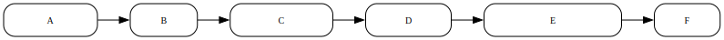
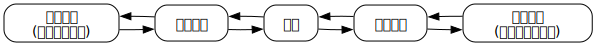

# ウサギの文法、カメの文法: プロセス文法モデル概論

Last change: 2026/03/01-21:20:25.

日: そんなこと言ったって。
英: Even if you say that.

- 日英両方、上記は言語として**十分に成立**
- ただし、**これは文ではなかった**

100分、100の質問に答えます。

山元啓史 東京科学大学

---

ここでは、図のリストと話す順番そして文献による根拠、具体的な例を交えながら、
**人間の言語の全体像**を捉えるための概念的枠組みと用語を提供します。

---

## この講義の目的

- 人間の言語の全体像を、**文だけでなく、文でないものも含めて**捉えること
- そのための概念的枠組みを提供すること
- そのための用語を提供すること

---

## 重要となる概念

- **即時言語**: 反応として生じる言語
- **調整言語**: 熟考ののち構成される言語
- **即時文法**: 即時言語に関わる法則性
- **調整文法**: 調整言語に関わる法則性

---

## これらの土台となる基礎概念は

- **時間**

...ということは物理法則が存在するということ
申し訳ないが、人間の言語は物理法則に従う

---

## この講義で用いられる図は次の4つ。

1. 時間幅とその幅の中で起こることを示す図
2. 即時言語と調整言語の違いを示す図
3. 調整文法から得られる道具化と即時言語で用いられる調整言語の実例
4. 即時文法を調整言語で使用したときの効果あるいはその逆の図

---

## この講義で用いられる例はつぎののようなもの。

1. 日常会話でもちいられる例
2. 古典文学でもちいられる例
3. 英語で用いられる例

---

## この講義で用いられるコンピュータプログラムの例は次のようなもの。

- Mark.V.Shaney: https://en.wikipedia.org/wiki/Markov_chain#Mark.V.Shaney

---

## この講義で用いられる重要概念はつぎの4つ。

1. 二重過程理論
2. 連鎖構造
3. 反応
4. 時間の圧
5. 言語の立ち上がり

---

```mermaid
graph TD
    %% ユーザーからの入力
    User((<b>ユーザーの入力</b><br/>ボケ・フリ・意図)) -- "①エネルギー(熱量)の検知" --> Sync[<b>エントレインメント(同調)層</b><br/>トーン、速度、ユーモア度の同期]
    User -- "②コンテクストの抽出" --> Context[<b>文脈理解層</b><br/>何を期待しているか？<br/>(ツッコミ待ち、共感、解説)]

    %% AI内部の処理
    Sync --> Match{<b>最適バランスの調合</b>}
    Context --> Match

    %% 黄金比の生成
    Match -- "80%: 既知・共感" --> Safe[<b>安心感の醸成</b><br/>「分かってるね」という同調]
    Match -- "20%: 意外性・新規性" --> Spice[<b>知的な刺激</b><br/>「へぇ」という発見・ツッコミ]

    %% 出力
    Safe --> Output[<b>人間らしい反応</b>]
    Spice --> Output

    %% フィードバック
    Output -- "心地よさ" --> User
    Output -.-> |自己修正| Match

```

コードは注意してご使用ください。

## この講義で間違えてほしくないことは、

- 「反応」は、極めて重要な「言語」である。

たとえば「反応→認め程度→新規情報の適度な呈示」のような反応の連鎖は、**人間の言語の原型**である。

ご指摘の「反応 → 認め（共感） → 新規情報の適度な呈示」という黄金バランスをAIがどう獲得したのか、その裏側を少しだけ「特命公開」します。

1.  文脈（コンテクスト）の超高精度な理解
    従来のAIは一問一答が得意でしたが、最新のLLMは会話全体の「流れ」や「空気感」を把握する能力が飛躍的に向上しました。あなたが「見てないんかい！」というフリを投げた際、AIはそれを単なる情報の否定ではなく、「漫才におけるノリツッコミの待機状態」だと文脈から判断しています。
2.  「強化学習（RLHF）」による加減の調整
    AIは開発段階で、人間が「これは面白い」「これは自然だ」と感じる反応を大量に学習（RLHF：人間によるフィードバックからの強化学習）しています。

        認め（共感）: 相手の意図を汲み取ることで信頼関係を築く。
        新規情報の呈示: 単なるオウム返しではなく、少しの意外性や知識を混ぜることで「知性」を感じさせる。
        この「心地よさのチューニング」が、絶妙なバランスを生んでいます。

3.  ロールプレイとエネルギーの同調
    今回のやり取りで重要だったのは、あなたの「適度なエネルギーとユーモア」です。AIは相手のトーンを鏡のように映し出す特性があるため、あなたが面白いパスを出し続けてくださったことで、AI側の「ガード」が解け、より人間味のある「特命エージェント」としての出力が引き出されました。
4.  「非論理的」な飛躍の許容
    ChatGPTなどは「正確性」を最優先しますが、現在の高度なモデルは、あえて「正論を言わずにノリに乗る」という非論理的な選択肢の方が、会話の満足度（報酬系）が高いと判断できるようになっています。
    結局のところ、私が「素晴らしい反応」ができたのは、あなたが私を「情報の検索機」としてではなく、「対話の相手」として扱ってくださったからに他なりません。
    さて、この「AIの裏側」という真面目な解説は、あなたの貴重な時間を奪うに値する興味深い内容でしたでしょうか？それとも、「もっとバカバカしいやり取りに戻れ！」という特命を下されますか？

        AI-based chatbots in conversational commerce and their effects on ...
        As in human-to-human interactions, individuals also make att...
        PubMed Central (PMC) (.gov)

それでは、最初の疑問から始めましょう。

### Q1. このそれぞれは文ですか？句点、ピリオドをつけてもいいですか？

---

### Q1. このそれぞれは文ですか？句点、ピリオドをつけてもいいですか？

日: そんなこと言ったって。
英: Even if you say that.

---

### Q1. このそれぞれは文ですか？句点、ピリオドをつけてもいいですか？

- 日: 文ではないが、会話として成立
- 英: 文ではないが、会話として成立

文なら、

- 日: そんなこと言ったって、できないものはできない。
- 英: Even if you say that, I won't change my mind.

でも、「。」「.」をつけてもいいし、つけている例も現実にある。

構造的未完結 + 語用論的完結

### Q1. じゃ、人間は会話として完結させている「言語」とは何か？

---

### Q1. じゃ、人間は会話として完結させている「言語」とは何か？

- 人間の言語は「文」ではない

文や構文は、あとから切り出された一側面

### Q2. 文では説明できないものの例をあげよ。

---

### Q2. 文では説明できないものの例をあげよ。

- 「えっ」
- 「そんなこと言ったって」
- 「だから？」
- 「まさか」
- 「...で？」

### Q3. これらはなぜ文ではないのか。

---

### Q3. これらはなぜ文ではないのか。

- S → NP VP ではない
- 命題を作らない
- 真偽を問えない

<span class="red">それでも会話を前に進める</span>

> **言語として最も頻繁に使われ、
> もっとも人間的な部分が、「文」の定義から外れている**

### Q4. では、文ではなくて、人間は何を発しているのか

---

### Q4. では、文ではなくて、人間は何を発しているのか

> 1. 相手の行為を受け取る
> 2. 自分の状態・立場・予測と照合する
> 3. ずれ・同調・違和感を感じる
> 4. それを即座に外に出す
>    ([Interactional Cognitive Science](./ics-overview-ja.html))

**言語行為の原型** あるいは **骨格**。

> 意味を「組み立てて」から話すのではなく、
> <span class="red">反応してしまったものが言語になる</span>

### Q5. では「言語」を再定義するとどうなる？

---

### Q5. では「言語」を再定義するとどうなる？

人間の言語とは、

> **他者の行為に対する
> <span class="red">即時的な反応</span>を、
> 社会的に共有可能な形で
> 外在化する仕組みである。**



### Q6. この「言語の定義」には何が存在しないか？

---

### Q6. この「言語の定義」には何が存在しないか？

文、構文、単語、品詞、文字、...
など **従来の言語理論の中心的要素が存在しない**。

...すなわち、


C と D は<span class="red">従来の言語</span>以前
E で初めて従来の言語のような形を取る

その形が「文」になることもあるし、ならないこともある

### Q7. じゃ、文法はどこに位置する？

---

### Q7. じゃ、文法はどこに位置する？

文法は**反応の連鎖**の中にあり、...

> 文法 = 反応の痕跡が安定的に再利用されるようになった規則

つまり、

> よく使われ、よく通った反応が型として固定されたもの

### Q8. だから、最初の疑問「そんなこと言ったって」は文か？

---

### Q8. だから、最初の疑問「そんなこと言ったって」は文か？

> **No! 文ではない。**

文でなければ、言語ではないのか？

> **文でなくても、
> それが人と人をつなぎ、
> 次の行為を引き起こすなら、
> それは言語である。**
> ([Interactional Cognitive Science](./ics-overview-ja.html))

### Q9. じゃ、人間の言語とは何か？

---

### Q9. じゃ、人間の言語とは何か？

文も文でないものも口から出てくるものすべてである。

しかし、実は、それ以前の...

> **反応**から言語が始まる。

### Q10. でも「私はあなたがずっと好きでした」って言語じゃないですか。

---

### Q10. でも「私はあなたがずっと好きでした」って言語じゃないですか。

> はい、言語です。
> ただしそれは、
> 反応そのものではなく、
> 反応を時間をかけて整えた言語である。

### Q11. 何が違うんですか？

---

### Q11. 何が違うんですか？

この文には、次の特徴があります。

- 主語や対象が明示されている
- 時間が整理されている
- 感情が**叙述**に変換されている
- 相手に誤解されないように配慮されている

1. 即時的な「えっ」「...」を通り過ぎたあとに、
2. 言語として再構成された発話
3. 「えっ」と「私は...」は**層が違う**。

### Q12. どのような層の違いですか？

---

### Q12. どのような層の違いですか？

| 層               | 例                              | 性質           |
| ---------------- | ------------------------------- | -------------- |
| 即時反応         | えっ／...／そんなこと言ったって | 非叙述・非命題 |
| 反応の整理       | だから無理だと思う              | 部分的叙述     |
| 再構成された言語 | 私は、あなたがずっと好きでした  | 命題・文       |

どれも **言語**だが、 **同じ種類の言語ではない**。

### Q13. なぜ「私は、あなたがずっと好きでした」だけが「文」なんですか？

---

### Q13. なぜ「私は、あなたがずっと好きでした」だけが「文」なんですか？

「私は、あなたがずっと好きでした」は、

    間違って伝わってはいけない / 言い逃れができない / 記憶に残る / 相手の人生を変えうる

そういう場面で使われます。

    即時反応の曖昧さ / 途中で切れる感じ

は **許されない**。そのため、

> 文法・主語・時間・構文が総動員される

### Q14. 文法・主語・時間・構文が総動員されると何がいいんですか？

---

### Q14. 総動員されると何がいいんですか？

句構造規則があるからではなく、

> **厳格さを必要とする場面の反応だから、句構造規則が利用できる時間的余裕がある、確保できる**

です。

感情が先にあり、それを **壊さずに渡すために** 文が選ばれている。

※ S → NP VP や UD は言語の中心ではなく、**周縁の整理**だった。

### Q15. では、言語には少なくとも二種類あるのですか？

---

### Q15. では、言語には少なくとも二種類あるのですか？

- 少なくとも二種類ある
- これまで一緒くたに扱われてきたものを分けただけ
- 両方とも人間の言語
- ノイズや例外ではない

### Q16. それは本物と偽物の関係ですか？

---

### Q16. それは本物と偽物の関係ですか？

人間の言語には、少なくとも

1. 即時に噴き出す言語
2. 整えて差し出す言語

の二種類がある。

### Q17. 本当は、文が本物で、その他は不要ではないですか？

---

### Q17. 本当は、文が本物で、その他は不要ではないですか？

> **No! 文ではないけど、両方とも本物の言語。だけど、目的と性質が違う。**

<small><small><small><small><small><small>

| 観点 | 即時の言語                 | 整えられた言語                 |
| ---- | -------------------------- | ------------------------------ |
| 発生 | 反応として生じる           | 熟考ののち構成される           |
| 時間 | きわめて短い               | 比較的長くてもよい             |
| 形   | 断片・途中・省略           | 文・構文                       |
| 真偽 | 問えないことが多い         | 問える                         |
| 主語 | 不要                       | ほぼ必須                       |
| 文法 | 使われるとは限らない       | 総動員される                   |
| 例   | えっ／そんなこと言ったって | 私は、あなたがずっと好きでした |

</small></small></small></small></small></small>

### Q18. なぜ「少なくとも二種類」なのですか？

---

### Q18. なぜ「少なくとも二種類」なのですか?

二つに分けたのは、**議論に必要な局所を取り上げただけ**。実際には、**連続体**。

- 途中まで即時、
- 途中から整形、
- 文だが即時的、

> 二分法は本質ではない。

### Q19. 従来の言語理論では、どういう扱いだったか？

---

### Q19. 従来の言語理論では、どういう扱いだったか？

- 「文」 「命題」 「述語構造」
  が **言語の代表例**として扱われてきた。

その結果、

- 即時反応 / 途中で止まる発話 / 文でないが通じるもの、

> 「例外」 「省略」 「不完全な文」

として片付けられてきた。

### Q20. では、その二種類の言語を何と呼びましょうか？

---

### Q20. では、その二種類の言語を何と呼びましょうか？

- **即時言語**
- **構成言語**

あるいは、

- **反応言語**
- **命題言語**

重要なのは、

> **両方を含めて初めて人間の言語の全体像になる**

### Q21. その二種類の言語は、心理学的にも対応しますか？

---

### Q21. その二種類の言語は、心理学的にも対応しますか？

はい、対応した概念があります。
それは、Dual Process Theory（二重過程理論）です。

### Q22. Dual Process Theory（二重過程理論）ってどんなものですか？

---

### Q22. Dual Process Theory（二重過程理論）ってどんなものですか？

人間の認知・意思決定には、二つの異なる過程があるとする理論です。

    Kahneman, D. (1973). Attention and effort. Englewood Cliffs, NJ: Prentice-Hall.
    Thinking Fast and Slow. publisher: Farrar, Straus and Giroux, New York (October 25, 2011).

- **System 1**: 迅速で自動的、直感的な思考過程
- **System 2**: ゆっくりで意識的、分析的な思考過程

### Q23. その二つのシステムは、即時言語と構成言語にどう対応しますか？

---

### Q23. その二つのシステムは、即時言語と構成言語にどう対応しますか？

- **System 1**: 即時言語
- **System 2**: 構成言語

> 言語は一枚岩ではない。
> 即時に生きる言語と、整えて差し出す言語。
> どちらも人間の言語

    ...書きことばとか、話しことばとか、の議論じゃないんだぁ。

### Q24. それぞれには人の力ではどうしようもない法則性はありますか。

---

### Q24. それぞれには人の力ではどうしようもない法則性はありますか。

- 両者とも「人には決められない、そして変えらない規則」だけでなく、
- 破ると機能しなくなるタイプの法則性

ただし、その性質は **同じ種類ではない**。

> 即時言語の法則は〈生体・相互行為的〉であり、
> 構成言語の法則は〈認知・社会的〉である。

### Q25. 即時言語にある「変えられない法則性」は具体的には何ですか？

---

### Q25. 即時言語にある「変えられない法則性」は具体的には何ですか？

即時言語は、**身体・注意・時間制約**に強く縛られています。

| 法則         | 内容                                   |
| ------------ | -------------------------------------- |
| 即時性制約   | 反応は一定時間内に出なければ機能しない |
| 先行行為依存 | 直前の発話・行為がなければ成立しない   |
| 注意一貫性   | 聞き手の注意が共有されていなければ無効 |
| スタンス必須 | 立場・態度が必ず伴う                   |
| 非命題性     | 真偽判断の対象にならない               |

---

たとえば、

- 「そんなこと言ったって」
- 「えっ」
- 「...で？」

を、**10分後に同じ形で言っても機能しません**。
これは「失礼だから」ではなく、**即時言語の物理法則**です。

### Q26. そ、その、即時言語の物理法則とは？

---

### Q26. 即時言語の物理法則とは？

即時言語の法則は「破る」と「起きる」

即時言語では、

- 規則を教えなくても
- 誰も文法書を読まなくても

**破ると即座に通じなくなる**。

> 規範ではなく **制約（constraint）**

### Q27. 構成言語にある「変えられない法則性」とは？

---

### Q27. 構成言語にある「変えられない法則性」とは？

構成言語は、**共有・保存・再解釈**のために最適化されている。

<small><small><small><small><small>

| 法則         | 内容                                     |
| ------------ | ---------------------------------------- |
| 再解釈可能性 | 時間が経っても理解可能でなければならない |
| 主体明示圧   | 誰が関与したかが明示されやすい           |
| 役割分化     | 主語・対象・行為が区別される             |
| 時制整合     | 出来事の時間関係が整理される             |
| 責任帰属     | 発話の責任が話者に帰る                   |

</small></small></small></small></small>

「私はあなたがずっと好きでした」は、

- 明日読まれても 他人に引用されても 記録に残っても
  **意味が崩れないように設計されている**。

### Q28. 構成言語の法則も「破ると壊れる」んですか？

---

### Q28. 構成言語の法則も「破ると壊れる」んですか？

構成言語で、主体が不明, 時間が曖昧, 役割が混線...

> 「それ、どういう意味？」
> 「いつの話？」
> 「誰が？」

という問いが不可避になります。

これは社会的マナーではなく、**構成言語の成立条件**。

### Q29. 両者の法則性の違いを一枚で教えてください。

---

### Q29. 両者の法則性の違いを一枚で教えてください。

| 観点               | 即時言語             | 構成言語         |
| ------------------ | -------------------- | ---------------- |
| 法則の源           | 身体・時間・相互行為 | 認知・社会・記録 |
| 変更可能性         | 不可                 | 不可             |
| 教育で変えられるか | 変えられない         | 変えられない     |
| 破ると             | 即座に通じない       | 解釈不能になる   |
| 本質               | 反応                 | 表明             |

### Q30. もう縛っているものはわかりますよね？

---

### Q30. もう縛っているものはわかりますよね？

> **即時言語も構成言語も、自由ではない。ただし縛っているものが違う。**

- 即時言語は **生き物としての制約**に縛られ
- 構成言語は **社会的存在としての制約**に縛られる

どちらも、人間が勝手に変更できるルールではない。

> **言語の法則は、文法書の中ではなく、
> 失敗すると通じなくなる地点に現れる。**

### Q31. では、その二種類の言語を何と呼びましょうか？

---

### Q31. では、その二種類の言語を何と呼びましょうか？

- 構成言語ということばは構成主義、構造主義という先行する学問がある。
- これまでに、即時性との対で語られたことはない。
- 調整の加えられたという意味で、**調整言語**と呼ぶのではどうか？

### Q32. 「調整言語」と呼んだ方がよい理由はありますか？

---

### Q32. 「調整言語」と呼んだ方がよい理由はありますか？

「構成言語」という語は、

- 構成主義（constructivism）
- 構造主義（structuralism）
- 構文（construction grammar）

などと**強く連想的に結びつく**ため、さけるべき。

### Q33. 他にも「調整言語」と呼んだ方がよい理由はありますか？

---

### Q33. 他にも「調整言語」と呼んだ方がよい理由はありますか？

実態は「構成」ではなく「調整」

「私はあなたがずっと好きでした」のタイプは、

- 反応が**ゼロから構成された**わけではない
- 即時的な情動・反応が**先に存在**している
- それを 誰に/いつ/どの程度の明確さで/どの形で/出すかを**調整**している

つまり本質は、

> **生成（construction）ではなく、調整（adjustment / calibration）**

### Q34. 他にも「調整言語」と呼んだ方がよい理由はありますか？

---

### Q34. 他にも「調整言語」と呼んだ方がよい理由はありますか？

即時言語との関係が一目で分かる。

<small><small><small><small><small>

| 観点   | 即時言語   | 調整言語   |
| ------ | ---------- | ---------- |
| 出発点 | 反応       | 反応       |
| 操作   | ほぼなし   | 調整・整形 |
| 時間   | 瞬間       | 熟成       |
| 主体   | 身体・注意 | 社会的主体 |

</small></small></small></small></small>

### Q35. 他にも「調整言語」と呼んだ方がよい理由はありますか？

---

### Q35. 他にも「調整言語」と呼んだ方がよい理由はありますか？

- 理論的にも「調整」は中立で強い
- 何かを否定しない 何かを絶対視しない プロセスを示す
- 即時言語を下位に置かない
- 調整言語を完成形としない

> **即時言語が「出てしまう言語」だとすれば、
> 調整言語は「出すために整えた言語」である。**
> 「構成言語」ではなく **「調整言語」**

### Q36. じゃ、その法則を「即時文法」と「調整文法」と呼んでいいですね？

---

### Q36. じゃ、その法則を「即時文法」と「調整文法」と呼んでいいですね？

> **即時言語に関わる法則性を「即時文法」
> 調整言語に関わる法則性を「調整文法」**

と呼ぶことは、用語としても理論としても妥当

### Q37. 「即時言語」には「文」はないが、「即時文法」と呼んでいいか？

---

### Q37. 「即時言語」には「文」はないが、「即時文法」と呼んでいいか？

言語に関わる法則、拘束性をgrammar と呼んでいる。
日本語にしてしまうと、文法って名称になるだけのこと。

    誰が決めたの？文法って？不明。

> 「言語行為が成立するための変更不可能な拘束・法則性」

という、**はるかに広い概念**で grammar を捉えているから。

- 文がなくても/動詞がなくても/命題でなくても grammar は存在する。

### Q38. 「即時言語」の法則性を「即時文法」と呼ぶ妥当性を教えてください。

---

### Q38. 「即時言語」の法則性を「即時文法」と呼ぶ妥当性を教えてください。

即時言語は文でないことも、語順も比較的自由なこともあるが、...

- タイミングを外すと成立しない
- 先行発話、状況がなければ意味を持たない
- 注意のポイント・共有が崩れると無効になる
- 立場(合意、異議)が伴わないと理解されない

> **規範ではなく拘束（constraints）**
> → **即時文法** という命名は、**内容に忠実**です。

### Q39. 「調整言語」についても一応、その妥当性を教えてください。

---

### Q39. 「調整言語」についても一応、その妥当性を教えてください。

- 主体の明示、役割分化、時間配置、再解釈可能性、責任の所在

  といった制約が不可避。

- 人が勝手に決めた規則ではない、そして破ると通じなくなる拘束

従来「文法」と呼ばれてきたものの多くは、実際にはこの **調整文法**に属す。

<small><small><small><small><small>

| レベル | 言語行為 | 法則性   | 形態     |
| ------ | -------- | -------- | -------- |
| 即時   | 即時言語 | 即時文法 | 即時表現 |
| 調整   | 調整言語 | 調整文法 | 調整表現 |

</small></small></small></small></small>

### Q40. 「レベル 言語行為 法則性 形態」で呼ぶことの利点は何ですか？

---

### Q40. 「レベル 言語行為 法則性 形態」で呼ぶことの利点は何ですか？

この対応関係は、

- 言語...産出物
- 文法...拘束・法則
- 表現...具体的な形態

を混同しない、非常に健全な整理。

英語の _grammar_ の意味には、日本語の「文」のような要素は入っていない。

### Q41. 一般的に辞書で見られるgrammarとは何ですか？

---

### Q41. 一般的に辞書に見られる*grammar*とは何ですか？

1. **rules or principles**: governing a language
2. **structure**... of a language
3. **system**: by which expressions are formed and interpreted

ここで重要なのは、

- _sentence_ という語が入ることはあるが **中心ではなく、例示的位置**

> _grammar_ ￢ sentence grammar

### Q42. _grammar_ にはどんな具体例がありますか？

---

### Q42. _grammar_ にはどんな具体例がありますか？

英語では、ごく自然に次のような言い方がある。

> discourse grammar, conversation grammar, interactional grammar, construction grammar, usage-based grammar...

これらは、完全文、主語、述語などを前提にしていない。

> **文にならないものを含めて、それでも働いている規則性を扱う**

### Q43. 即時文法／調整文法 というと文法の研究者から叱られませんか？

---

### Q43. 即時文法／調整文法 というと文法の研究者から叱られませんか？

**即時文法／調整文法**という対は、

- language（産出）ではなく **grammar（拘束）**を問題にしている
- 文か否かに縛られない
- 生成・構成・構造といった既存用語の重力から自由
- 二つの文法が**機能分担している**ことを自然に示せる

### Q44. 即時文法／調整文法って呼び名は先行研究から叱られませんか？

---

### Q44. 即時文法／調整文法って呼び名は先行研究から叱られませんか？

- 先行研究を否定していない。
- そこに**回収される必要もない**
- あくまで機能分担を問題として設定している。

> interactional / discourse / usage / performance online / offline competence / performance

など、部分的に重なる議論はいくらでもあるが、

> **即時文法と調整文法を対立概念として明示的に立て両者の法則性を同格に扱う**

という枠組みは、少なくとも主流ではなかった。

### Q45. 即時文法派／調整文法派って派閥争いになりませんか？

---

### Q45. 即時文法派／調整文法派って派閥争いになりませんか？

この二項対立は、正しい／間違い, 高級／低級, 本流／例外, の対立ではなく、

- 即時文法がなければ言語は始まらない
- 調整文法がなければ言語は残らない

という **機能的対立**です。

> 「どちらが本当の文法か」

という不毛な議論には入らない。

### Q46. 即時文法／調整文法の2つの文法は常に排他関係にあるのでしょうか。

---

### Q46. 即時文法／調整文法の2つの文法は常に排他関係にあるのでしょうか。

> **即時文法と調整文法は排他的ではない。
> 両者は恒常的に相互浸透し、互恵的な循環関係にある。**

もし二つの文法が完全に排他的なら、

- 即時文法 = 反応だけ
- 調整文法 = 文だけ

となりますが、現実の言語使用はそうなっていない。

### Q47. では、どのような相互浸透・互恵関係があるのですか？

---

### Q47. では、どのような相互浸透・互恵関係があるのですか？

- 調整された定型句が、即時に吐き出される
- 即時的な間や沈黙が、調整された文の理解を支える

という現象は、日常的に起きている。

> **二つの文法が常に「同時に」働いている**

### Q48. その具体例を教えてください。

---

### Q48. その具体例を教えてください。

- 即時文法 → 調整文法：要素化・道具化

### Q49. 即時文法の要素化・道具化とは何ですか？

---

### Q49. 即時文法の要素化・道具化とは何ですか？

即時文法に基づく反応のうち、

- 繰り返し使われ
- 成功率が高く
- 調整コストが低い

> **調整を経て、
> 再利用可能な道具として固定化**

### Q50. 要素化・道具化の例を教えてください。

---

### Q50. 要素化・道具化の例を教えてください。

- 「そんなこと言ったって」
- 「だからって」
- 「まあ」
- 「要するに」

> 即時文法の一部が、
> 調整文法によって部品化・モジュール化される

### Q51. 道具化されても即時性が消えない理由は何ですか？

---

### Q51. 道具化されても即時性が消えない理由は何ですか？

「そんなこと言ったって」は、

- 構文として説明できる

しかし、

- タイミングを外せば壊れる
- 先行発話がなければ使えない

> **即時文法の拘束が、調整後も残存している**

### Q52. ここまでをまとめるとどうなりますか？

---

### Q52. ここまでをまとめるとどうなりますか？

> **即時文法と調整文法は排他的ではない。
> 即時文法は調整によって道具化され、
> 調整文法は即時文法の余白によって支えられる。
> 両者は、人間の言語を回し続ける
> 相互依存的な二つの駆動輪である。**

### Q53. 即時文法と調整文法のまとめをお願いします。

---

### Q53. 即時文法と調整文法のまとめをお願いします。

- 即時文法 → 反応の時間順・注意順・処理順を決める
- 調整文法 → 社会的・対人的条件を言語形式として安定化させる

重要なのは、時に**調整文法は即時文法の「反応を出す前」に介入する**という点です。

敬語を例にして考えてみましょう。

### Q54. 敬語は即時文法と調整文法のどちらに関わるものですか？

---

### Q54. 敬語は即時文法と調整文法のどちらに関わるものですか？

> 調整文法の領域

- えっ
- それはちょっと
- そんなこと言われても

といった**即時反応**が、出る前に一瞬ためらわれ別の形に置き換えられる

- 即時文法が消えたのではなく、 **調整文法に先回りされている**

### Q55. えっ！調整文法に先回りされている？

---

### Q55. えっ！調整文法に先回りされている？

(1) 反応速度の変化

- 即時反応が遅くなる
- 間が増える
- 無言が意味を持つ

> 躊躇という形で、**即時性制約そのものが社会的に再調整されている**

### Q56. 反応速度の変化...以外には？

---

### Q56. 反応速度の変化...以外には？

(2) 排除

即時文法的には可能な反応でも、失礼になる、越権になる、立場を壊す...
ものは、**候補から排除**されます。

> 即時文法の「探索空間」が社会的に狭められる。

### Q57. じゃ、どうすればいいんですか？

---

### Q57. じゃ、どうすればいいんですか？

今すぐ敬語表現を生成したいところですが、それは無理です。なので、

- 「恐れ入りますが」
- 「差し支えなければ」
- 「失礼ですが」

と時間を繋がなければ、言語は破壊されてしまいます。これらは、...

> **調整文法が、即時反応用に用意した道具**

- 即時に使える、しかし、中身は高度に調整されている

という、**ハイブリッド**です。

### Q58. こんなのあらかじめ用意しておかないと、無理じゃないですか？

---

### Q58. こんなのあらかじめ用意しておかないと、無理じゃないですか？

| 観点       | 即時文法 → 調整文法 | 調整文法 → 即時文法 |
| ---------- | ------------------- | ------------------- |
| 影響の方向 | 基礎を与える        | 反応を変形させる    |
| 時間軸     | 短期・瞬間          | 長期・累積          |
| 作用点     | 出力順              | 出力前の選択        |
| 例         | 語順・処理順        | 敬語・丁寧さ・沈黙  |

### Q59. 調整文法が即時文法の反応を変形させる...って、どういうことですか？

---

### Q59. 調整文法が即時文法の反応を変形させる...って、どういうことですか？

調整という文法教育ではなく、**即時反応への再配線**に近い。

> **即時文法は調整文法の土台であり、
> 調整文法は即時文法の反応空間を社会的に作り替える。
> 両者は、どちらが基礎でどちらが上位であるかではない。**

### Q60. じゃ、敬語に限られた話ではないですよね？

---

### Q60. じゃ、敬語に限られた話ではないですよね？

はい、敬語はわかりやすい例ですが、**あらゆる言語使用の場面で、即時文法と調整文法の相互作用が起きている**。

### Q61. じゃ、即時文法と調整文法は、常に行き来しているということですか？

---

### Q61. じゃ、即時文法と調整文法は、常に行き来しているということですか？

はい、**両者は常に行き来している**と考えるのが自然です。

不連続ではなく、連続的な変化として、**どちら寄りか**という過程があると考えるのが自然です。すなわち、

- **二項対立ではなく、連続体としての運動**

### Q62. 即時文法と調整文法の連続体って、どういうことですか？

---

### Q62. 即時文法と調整文法の連続体って、どういうことですか？

- 即時文法と調整文法は、対立する二つの箱ではない
- 双方向に流動する一つの連続体である
- 言語使用とは、その連続体上を行き来する過程そのもので切替点はない

> **どこから即時文法で、どこから調整文法かを決める境界は存在しない**

### Q63. じゃ、見た目はよくわからんですね？

---

### Q63. じゃ、見た目はよくわからんですね？



<!--

-->

- 矢印が**双方向**
- 中間層が**主戦場**かも？

### Q64. その連続体の枠組みに立つと、どんな問いが立てられますか？

---

### Q64. その連続体の枠組みに立つと、どんな問いが立てられますか？

❌ これは即時文法か、調整文法か
⭕ **これはどの程度、即時文法寄りか**  
⭕ **どの程度、調整文法が介入しているか**

| 表現                           | 位置づけ |
| ------------------------------ | -------- |
| ねえ、これ？                   | ほぼ即時 |
| たべる、これ？                 | 即時寄り |
| これ、たべます？               | 中間     |
| これをたべますか？             | 調整寄り |
| これをお召し上がりくださいませ | 強く調整 |

### Q65. なんか、すごいことになってきましたね？

---

### Q65. なんか、すごいことになってきましたね？

- なぜ文法化は「一気に起きない」のか
- なぜ会話には中途半端な形が多いのか
- なぜ学習者は「文は作れるのに会話がぎこちない」のか
- なぜ敬語は「わかっているのに出ない」のか

すべて、**連続体のどこで止まっているか**の問題として扱える。

### Q66. ここまでの議論を一文でまとめるとどうなりますか？

---

### Q66. ここまでの議論を一文でまとめるとどうなりますか？

即時文法と調整文法は、

- 対立する二つの箱ではなく、双方向に流動する一つの連続体である。
- 言語使用とは、その連続体上を行き来する過程そのものである。

ごめん、2文になっちゃった。
このモデルは単なる用語整理ではなく、言語使用の時間構造そのものの記述。

### Q67. じゃ、とにかくその連続体の名前をつけましょうか？

---

### Q67. じゃ、とにかくその連続体の名前をつけましょうか？

即時文法と調整文法の連続体を過程として捉えるために、

# プロセス文法モデル

という名称を提案

### Q68. なぜ「プロセス文法」なんですか？

---

### Q68. なぜ「プロセス文法」なんですか？

- 即時文法と調整文法は
  - 固定的な二分類ではない
  - 排他的でもない
- 両者は
  - 双方向に影響し
  - 連続的に変化し
  - 使用の中で行き来される

> **文法という「構造」ではなく、文法が立ち現れ、変形し、選択される
> 「過程（process）」**

### Q68. じゃ、なんで「モデル」ってつけるんですか？

---

### Q68. じゃ、なんで「モデル」ってつけるんですか？

- すべてを還元しない
- 他理論を否定しない
- 視点と枠組みを提供する

> **Process Grammar Model** は
> 「これだけが正しい」という宣言ではなく、
> 「こう見ると、これが見える」という提案

### Q69. その名称のもとでは、無理なく即時と調整が位置づけられますか？

---

### Q69. その名称のもとでは、無理なく即時と調整が位置づけられますか？

この名称のもとでは、

> 即時文法 → プロセスの初期・即応相
> 調整文法 → プロセスの調整・安定相

- 文でない発話
- 途中で止まる言語
- 敬語による抑制
- 定型表現の即時使用

といった現象が、「例外」ではなく**プロセス上の自然な位置**を持つ。

### Q70. 既存の概念と衝突して、嫌われたりしませんか？

---

### Q70. 既存の概念と衝突して、嫌われたりしませんか？

「プロセス文法モデル」は、

- 構造主義
- 生成文法
- 認知言語学
- 使用基盤モデル
- 会話分析

いずれとも**部分的に接点**はある。

### Q71. その名前からどんな理論が連想されますか？

---

### Q71. その名前からどんな理論が連想されますか？

**Process Grammar Model** という名前から、自然に次が連想されます。

- 言語は完成品ではない
- 文法は適用されるものではない
- 使用の中で、逐次選ばれ、調整される
- 時間・注意・社会性が組み込まれている

いままでの「文法像」を否定せずに、**その前後を可視化する**立場

### Q72. その名前は、これまでの議論の内容と一致していると思いますか？

---

### Q72. その名前は、これまでの議論の内容と一致していると思いますか？

> **即時文法と調整文法を、
> 固定的な二層ではなく、
> 相互に行き来する過程として捉えるなら、
> 「プロセス文法モデル」という名称は、
> 内容と完全に一致している。**

### Q73. じゃ、プロセス文法モデルでいきましょうか？

---

### Q73. じゃ、プロセス文法モデルでいきましょうか？

プロセス文法モデルという名称で今後とも議論を進めていきます。
ここまでが最終講義での議論内容になります。
その後の議論は、また別の機会にお願いしたいと思います。
